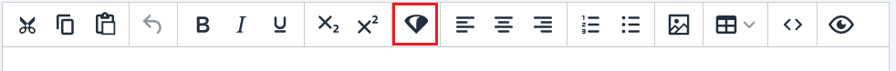
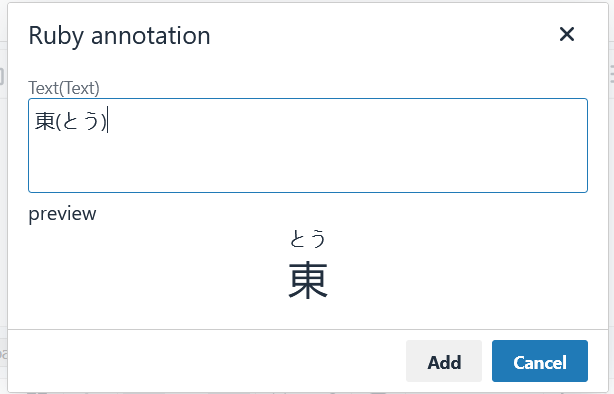
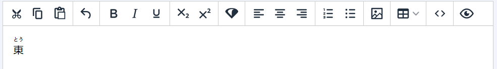

# rubyAnnotation TinyMCE Plugin

This is a repo containing the rubyAnnotation TinyMCE plugin.

Developed at the University of Nottingham

Contributors:

* Dr Joseph Baxter
* Naseem Sarwar

## Getting started

[Install npm](https://docs.npmjs.com/downloading-and-installing-node-js-and-npm)

Install yarn globally ```npm install --global yarn```

Install the dependencies by running ```npm install```

### Deploy instructions

Run ```yarn build``` to creat dist directory

Copy dist/ruby-annotation to the desired location

See [documentation about loading external plugins](https://www.tiny.cloud/docs/configure/integration-and-setup/#external_plugins)

## Functionality

Adds a ruby annotation button to the toolbar



This launches a dialog where you enter your kana in brackets



A preview is displayed and onec you are happy this can be added to the editor


